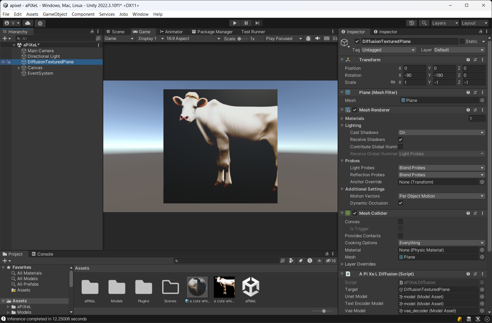

# aPiXeL (aka PAul/chuanXIn/LEo)
Stable Diffusion with Unity Sentis

This project is essentially a port of https://github.com/cassiebreviu/StableDiffusion to Unity Sentis 

## Plugins:

Since Sentis does not support Tensor Strings yet, hence ClipTokenizer runs on ONNXRuntime.
Please copy the following ONNX dlls to Plugins folder:

- Microsoft.ML.OnnxRuntime.dll
- NumSharp.dll
- onnxruntime.dll
- onnxruntime_providers_shared.dll
- ortextensions.dll
- System.Runtime.CompilerServices.Unsafe.dll

## Models:

- Download Stable Diffusion ONNX files from https://huggingface.co/CompVis/stable-diffusion-v1-4/tree/onnx and copy to Models/sd_14 folder.
- Download https://github.com/cassiebreviu/StableDiffusion/blob/main/StableDiffusion.ML.OnnxRuntime/cliptokenizer.onnx and copy to Models/sd_14/tokenizer folder.

## Sentis:

Please make the following changes to Sentis Package. You may need to move the Sentis package from /Library/PackageCache to /Packages before making changes:

Runtime/Core/TensorFloat.cs : Add the following function

    public NativeArray<float>.ReadOnly ToReadOnlyNativeArray()
    {
        return base.ToReadOnlyNativeArray<float>();
    }

## Unity:

Please use the latest 2022.3 version of Unity. You may also need access to Unity Sentis.

## Demo:

***dreamraster***
