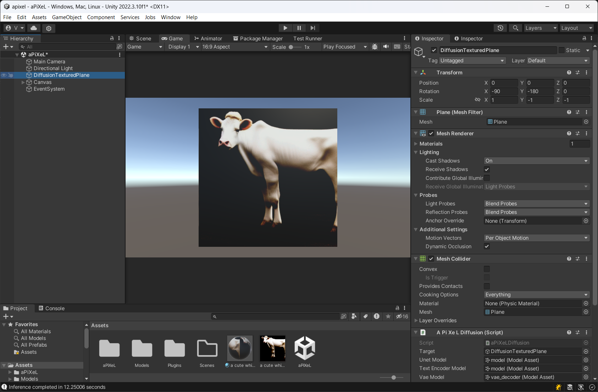

# aPiXeL - Unity Sentis Stable Diffusion Implementation


[](https://opensource.org/licenses/MIT)

This README.md is generated by Qvenkify_Q4. Expect imperfection.

**aPiXeL** (also known as **aPiXeLDiffusion**) is an early C# implementation of Stable Diffusion that leverages **Unity Sentis** - Unity's native deep learning inference runtime. This project was among the first to bring Stable Diffusion inference capabilities to Unity through its built-in ML framework, eliminating the need for external Python dependencies while running entirely in C#.



## Table of Contents

- [Overview](#overview)
- [Features](#features)
- [Architecture](#architecture)
- [Project Structure](#project-structure)
- [Installation](#installation)
- [Usage](#usage)
  - [Stable Diffusion Pipeline](#stable-diffusion-pipeline)
  - [Segment Anything (SAM)](#segment-anything-sam-integration)
  - [U2-Net Background Removal](#u2-net-background-removal)
- [Technical Details](#technical-details)
- [Dependencies](#dependencies)
- [Performance Considerations](#performance-considerations)
- [Known Limitations](#known-limitations)
- [License](#license)

---

## Overview

aPiXeL implements the Stable Diffusion algorithm using Unity's Sentis compute framework. The project provides a complete end-to-end pipeline for text-to-image generation entirely within Unity, including:

- **Text Encoding** with CLIP text encoder (ONNX)
- **U-Net** noise prediction inference
- **Scheduler** for K-Diffusion sampling
- **VAE Decoder for image reconstruction

Built on this foundation, the project also includes implementations of:

- **Segment Anything Model **(SAM) - Zero-shot image segmentation
- **U2-Net** - Background removal and matting

---

## Features

| Feature | Description |
|---------|-----------|
| **Text-to-Image Generation** | Generate images from text prompts using Stable Diffusion 1.4 |
| **GPU Acceleration** | Leverages Unity Sentis GPU compute shaders for inference |
| **K-Diffusion Scheduler** - Native C# implementation of the scheduler with sigma scheduling |
| **Burst Compilation** - Performance-critical tensor operations use Unity Burst for native C# optimization |
| **Tensor Operations** - Add, Subtract, Multiply, Divide with native memory management |
| **Segment Anything** - Integrate SAM for zero-shot object segmentation |
| **Background Removal** - U2-Net based background removal pipeline |
| **Editor Integration** - Inspect and generate images directly in Unity Editor |

---

## Project Structure

```
aPiXeL/
├── Assets/
│   ├── aPiXeL/                       # Main implementation
│   │   ├── Core/
│   │   │   ├── Engine.cs             # Base engine wrapper for Sentis workers
│   │   │   └── Utility.cs            # Burst-compiled tensor operations
│   │   ├── Diffusion/
│   │   │   ├── Diffuser.cs           # Main orchestration class (Stable Diffusion)
│   │   │   ├── Scheduler.cs          # K-Diffusion scheduler with sigma scheduling
│   │   │   ├── Unet.cs               # U-Net inference wrapper
|   |   |   ├── TextEncoder.cs        # CLIP text encoder integration
|   |   |   ├── Tokenizer.cs          # ONNX-based tokenizer
|   |   │   └── Settings.cs           # Generation parameters (width, height, etc.)
│   │   ├── Sam/                      # Segment Anything Model implementation
│   │   │   ├── Sam.cs / SamEditor.cs
│   │   ├── U2Net/                    # Background removal network
│   │   │   ├── U2Net.cs / U2NetEditor.cs
│   │   └── aPiXeLDiffusion.cs / aPiXeLDiffusionEditor.cs
│   ├── Models/
│   │   └── sd_14/                    # Stable Diffusion 1.4 ONNX models
│   │       ├── unet/model.onnx
│   │       ├── textencoder/model.onnx
│   │       ├── vae/vae_decoder.onnx
│   │       └── tokenizer/cliptokenizer.onnx
│   ├── Materials/
│   │   └── PreProcess.shader         # Fragment shader for tensor normalization
│   └── Plugins/                      # ONNX Runtime dependencies (for tokenizer)
│       ├── Microsoft.ML.OnnxRuntime.dll
│       ├── NumSharp.dll
│       ├── onnxruntime.dll
│       └── ...
│   ├── aPiXeL.unity                 # Demo scene
│   └── RemoveBG.unity               # Background removal demo
│   └── Sam.unity                    # SAM segmentation demo
```

---

## Architecture

### High-Level Pipeline

```
Prompt String
     │
     ▼
[Text Encoder (ONNX)]   →  Text Embeddings
     │
     ▼
[Scheduler]             →  Noise Schedule
     │
     ▼
[Latent Initialization] → Random noise tensor
     │
     ▼
[U-Net Inference Loop]
     │    ├── Text embedding + latent input
     │    ├── Noise prediction (multi-pass)
     │    └── Scheduler step with sigma calculations
     │
     ▼
[VAE Decoder]           →  Latent space → Image space
     │
     ▼
   PNG Output
```

### Core Components

#### Engine (`Core/Engine.cs`)
The foundational class that wraps Unity Sentis workers:
- Loads ONNX models as `ModelAsset`
- Creates appropriate `IWorker` (GPU/CPU compute)
- Provides both full-model execution and step-by-step (`ExecuteLayerByLayer`) for debugging
- Manages inference lifecycle with proper disposal

#### Diffuser (`Diffusion/Diffuser.cs`)
Main orchestrator class that coordinates the complete Stable Diffusion pipeline:

```csharp
public void Execute(string prompt, int steps, float guidance, int seed, string outputPath)
```

The diffuser:
1. Tokenizes text prompt using ONNX Runtime (ClipTokenizer)
2. Encodes text to embeddings via TextEncoder (ONNX)
3. Initializes random latent noise
4. Runs K-Diffusion sampling loop
5. Decodes latents to image via VAE decoder
6. Saves output as PNG

#### Scheduler (`Diffusion/Scheduler.cs`)
Implements the K-Diffusion scheduler with:
- Sigma generation from noise schedule
- Timestep interpolation
- Noise prediction application
- Stochastic sampling with sigma noise addition

#### Utility (`Core/Utility.cs`)
Provides high-performance tensor operations with Burst compilation:
- `Add()`, `Subtract()`, `Multiply()`, `Divide()` - Element-wise operations
- `CreateRandomTensor()` - Gaussian random tensor generation (Box-Muller transform)
- `Guidance()` - CFG scaling (classifier-free guidance)

---

## Installation

### Prerequisites
- Unity 2022.3 or later
- Sentis package installed (via Package Manager)

### Setup Steps

1. **Clone or copy the project** to your Unity project's `Assets` folder

2. **Install ONNX Runtime DLLs** in `Assets/Plugins`:
   - Microsoft.ML.OnnxRuntime.dll
   - NumSharp.dll
   - onnxruntime.dll
   - onnxruntime_providers_shared.dll
   - ortextensions.dll
   - System.Runtime.CompilerServices.Unsafe.dll

3. **Download ONNX Models**:
   ```bash
   # Create folder structure
   Assets/Models/sd_14/
   Assets/Models/sd_14/unet/
   Assets/Models/sd_14/textencoder/
   Assets/Models/sd_14/vae/
   Assets/Models/sd_14/tokenizer/
   ```

4. **Patch Sentis Package** (if using Unity's Library/Sentis):

   Edit `Runtime/Core/TensorFloat.cs` in the Sentis package:
   ```csharp
   public NativeArray<float>.ReadOnly ToReadOnlyNativeArray()
   {
       return base.ToReadOnlyNativeArray<float>();
   }
   ```

### Model Downloads

Download models from [Stable Diffusion ONNX](https://huggingface.co/CompVis/stable-diffusion-v1-4/tree/onnx):

```
sd_14/
├── unet/
│   ├── model.onnx
│   └── weights.pb
├── textencoder/
│   ├── model.onnx
│   └── config.json
└── vae/
    ├── vae_decoder.onnx
    └── vae_encoder.onnx
```

---

## Usage

### Stable Diffusion Pipeline

#### Basic Usage

```csharp
using aPiXeL;

// Create diffuser instance
var diffuser = new Diffuser();

// Initialize with model assets
diffuser.Initialize(
    unetModel,
    textEncoderModel,
    vaeDecoderModel,
    null
);

// Generate image
diffuser.Execute(
    prompt: "a cute white cow",
    steps: 50,
    guidance: 7.5f,
    seed: 42,
    outputPath: Application.dataPath + "/output/generated.png"
);
```

#### Editor Integration

The project includes an editor extension for easy generation from within Unity:

1. Create a new GameObject
2. Add the `aPiXeLDiffusion` component
3. Assign your models:
   - Unet Model (U-Net)
   - Text Encoder Model
   - VAE Model
4. Click "Create" to generate

### SAM Integration (Segment Anyting Model)

```csharp
public class SamUsage : MonoBehaviour
{
    public GameObject inputObject;
    public GameObject outputObject;
    public Vector2 segmentLocation;

    void Start()
    {
        // Encode image embeddings
        var encoderEngine = new Engine();
        encoderEngine.Init(samEncoderModel, BackendType.GPUCompute);

        // Decode with point prompts
        var decoderEngine = new Engine();
        decoderEngine.Init(samDecoderModel, BackendType.GPUCompute);
    }
}
```

### U2-Net Background Removal

```csharp
public class BackgroundRemover : MonoBehaviour
{
    public ModelAsset backgroundRemoverModel;

    void RemoveBackground(Texture2D input)
    {
        var engine = new Engine();
        engine.Init(backgroundRemoverModel, BackendType.CPU);

        // Preprocess and run inference
        var tensor = TextureConverter.ToTensor(preprocessedInput);
        var output = engine.Execute(tensor) as TensorFloat;

        // Post-process to get mask
    }
}
```

---

## Technical Details

### Tensor Operations

The project uses Unity's `TensorFloat`/`TensorInt` types with native memory management:

```csharp
// Create tensor from NativeArray
var res = new NativeArray<float>(length, Allocator.Temp);
unsafe
{
    var raw = (float*)NativeArrayUnsafeUtility.GetUnsafeReadOnlyPtr(res);
}

// Operations use Burst compilation for performance
internal static TensorFloat Add(TensorFloat a, TensorFloat b)
{
    // ... Burst-compiled addition
}
```

### K-Diffusion Scheduling

Implements the K-LMS scheduler from the original Stable Diffusion implementation:

```csharp
// Sigma calculation
sigmas[step] = sqrt((1 - alpha_prod) / alpha_prod)

// Noise scheduling
denoised = sample - model_output * sigmas[step]

// Stochastic sampling with noise
prev_sample = sample + derivative * dt + noise * sigma_up
```

### CLIP Text Encoder

Uses ONNX Runtime (not Sentis) because Sentis lacked tensor string operations at the time of creation:

```csharp
// TextEncoder runs on ONNX Runtime
var session = new InferenceSession(path);
var tokens = tokenizer.Execute(prompt);
```

---

## Dependencies

| Component | Purpose |
|-----------|---------|
| **Unity 2022.3+** | Runtime and Editor |
| **Sentis Package** | Native ML inference framework |
| **ONNX Runtime** | Text encoder and tokenizer (temporary workaround) |
| **NumSharp** | Numerical computing in Scheduler |

---

## Performance Considerations

- Uses `BackendType.GPUCompute` for U-Net and text encoder
- Falls back to CPU for VAE decoder on older hardware
- Burst-compiled tensor operations in Utility.cs provide native performance
- Memory is explicitly managed through NativeArrays with `Allocator.Temp`

### Optimization Tips

1. **Batch Operations**: Reuse tensors where possible to reduce GC pressure
2 **GPU Synchronization**: Call `Wait()` on CPU-intensive schedulers for smoother progress
3. **Model Loading**: Cache initialized engines instead of recreating per-frame

---

## Known Limitations

- Requires ONNX Runtime for text tokenization (Sentis lacked tensor string support at the time)
- VAE decoding runs on CPU due to Sentis layer-by-layer execution constraints
- Memory-intensive - requires sufficient GPU memory for full 512x512 resolution
- Editor-only generation mode (not optimized for runtime frame generation)

---

## License

MIT License - see [LICENSE](LICENSE) for details.

---

## Author

**aPiXeL** project by *dreamraster*

---

## Acknowledgments

- Stable Diffusion by [CompVis/StableDiffusion](https://github.com/CompVis/stable-diffusion)
- Unity Sentis team for the inference framework
- Original port author: cassiebreviu/StableDiffusion

---

*This project demonstrates that entire AI pipelines can run entirely in C# within Unity, enabling real-time generative AI applications that work across platform targets supported by Unity's player architecture.*
